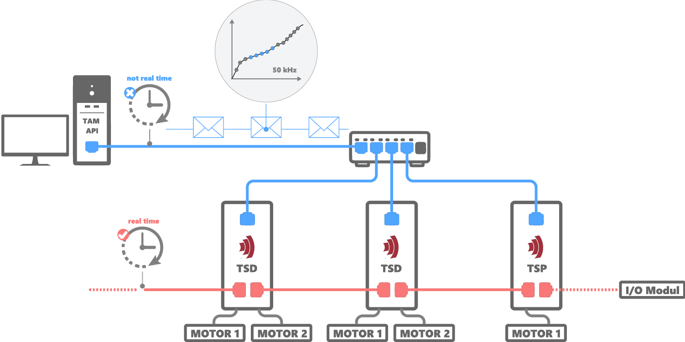
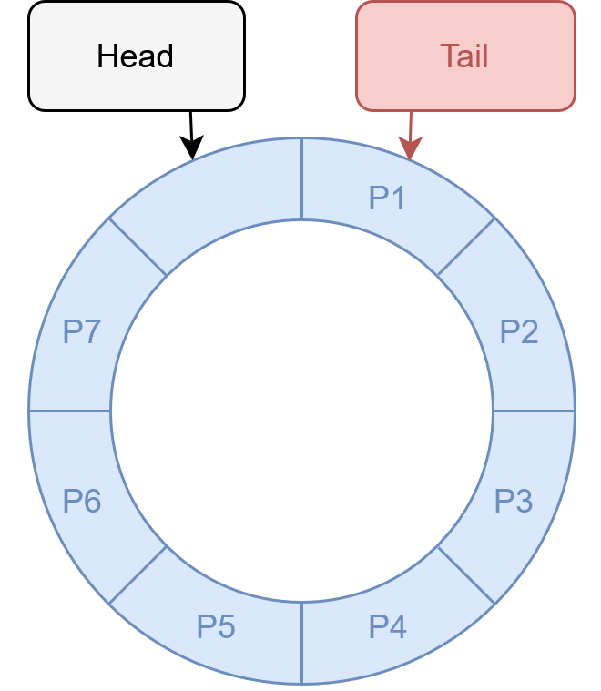

# TraSt-CSV
This C# console application demonstrates trajectory streaming (TraSt) for motion control systems. It enables users to stream predefined motion paths - loaded from a CSV file- to one or more motiion axes. The application continuously sends trajectory segments to the drives and provides feedback. At any time, the user can safely abort the streaming process by pressin 'q'. 

This example project illustrates how to use the TraSt feature of the TAM API and serves as a beginner-friendly introduction to basic trajectory streaming workflows. 

## What is Trajectory Streaming
Trajectory streaming is a technique used to execute complex motion profiles in real time by separating path calculation from execution. 
In this application, the motion path is precomputed and stored in a CSV file. 

The host system reads this file and divides the trajectory into small segments. These segments are continuously sent to a ring buffer on the drive. While the host keeps loading new segments into the buffer, the drive reads and executes them in real time - ensuriog smooth, uninterrupted motion. This enables high-frequency motion, even though the host system itself is not real-time capable. The TAM API manages the streaming process and ensures the buffer never overflows or underflows, allowing seamless real-time execution on the drive side.

The following image illustrates this workflow and shows the interaction between the host PC and the drive:

## View results in System Explorer
Visualizing the results can make understanding easiert. The TAM System Explorer allows you to see, what happens inside the application. The following image shows two axes controlled by the application, moving along the precomputed trajectory path: 

**TODO: make a good CSV-File and take a snap of System explorer**

To understand the TableHead and TableTail, the following image may help:

  

The ring buffer (blue) is a fixed-size circular data structure where the end connects back to the start. On the drive, this ring buffer has many more entries than shown here. Data is written at the head and read from the tail. When either pointer reaches the end of the buffer, it wraps around to the beginning. The buffer is full when the head is about to overwrite unread data at the tail, and empty when the head and tail are at the same position.
In the System Explorer, the head is shown in black — always a bit ahead — and the tail in red, showing the current read position of the drive.

## Hardware Prequisites
- A Triamec drive is required to run the application.
- The drive must be running firmware version 4.25.0 or higher and have the TS feature key enabled (TraSt License).
- If you want to operate the drive without a motor, upload the configuration file TraSt1.TAMcfg from this GitHub repository to your drive.
- If using motors, each axis must have a motor and encoder connected and configured with a stable position controller.
- The drive must be connected via Ethernet.
- When controlling multiple drives, they must be connected using Ethernet in a TriaLink.

## Software Prequisites
- This project is made and built with [Microsoft Visual Studio](https://visualstudio.microsoft.com/en/)
- It is reccomended to visualize the behaviour of the application in the  [TAM Software](https://www.triamec.com/en/tam-software-support.html) installation

## Operate the TraSt-CSV Application
The TraSt-CSV application is a command-line tool that initializes the TAM system and streams a trajectory path from a CSV file to multiple motion axes. It consists the following core components:
- **Program:** Serves as the entry point of the application
- **Controller:** Orchestrates the main workflow. It initializes the TAM system, sets up the axis group, and coordinates the streaming of trajectory data. It relies on helper classes (CsvParser and StreamingAbortListener) to perform specific tasks.
- **CsvParser:** Handles reading and parsing of the CSV file. It extracts header metadata and provides access to the trajectory data in segments for streaming.
- **StreamingAbortListener:** Runs in a background thread and listens for the user to press 'q' or 'ESC' key to safely abort the streaming process. It also provides an AbortByError() method for handling unexpected errors, and tracks whether streaming was stopped by user input or due to a failure.
